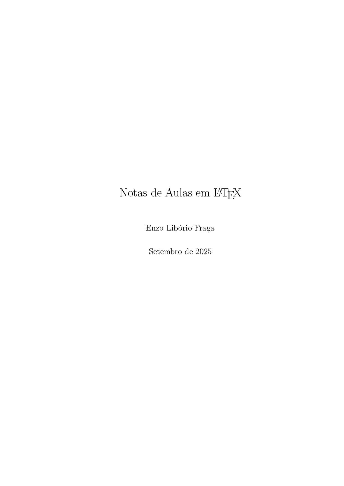
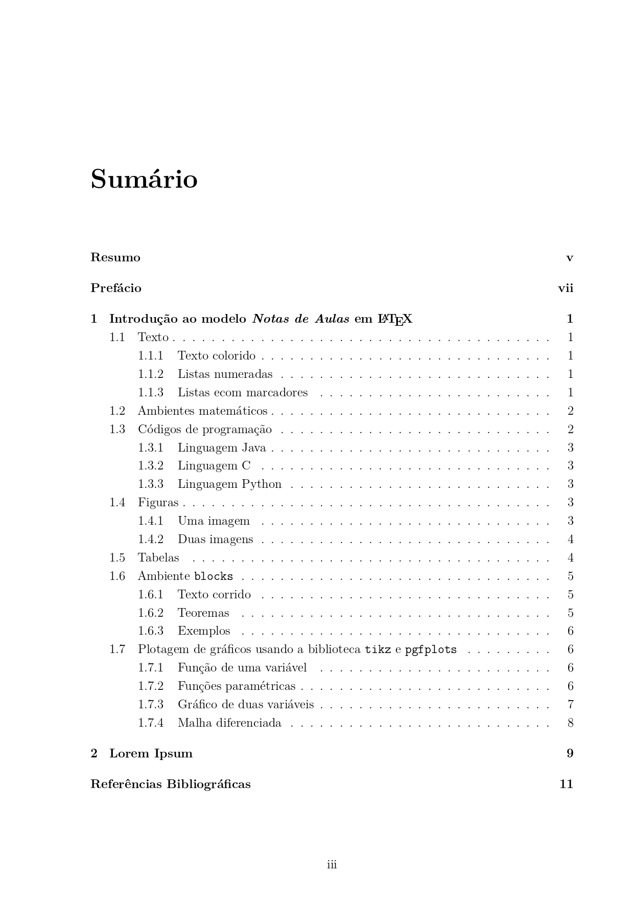
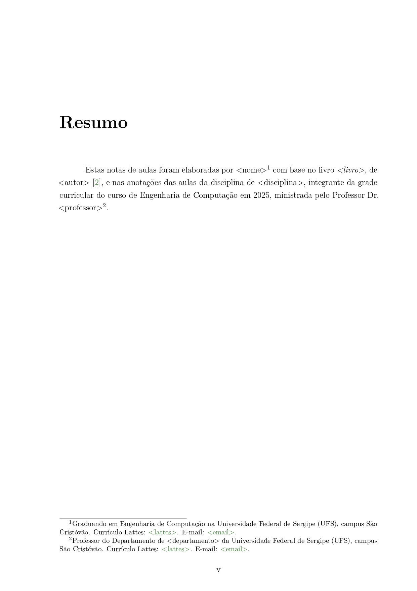
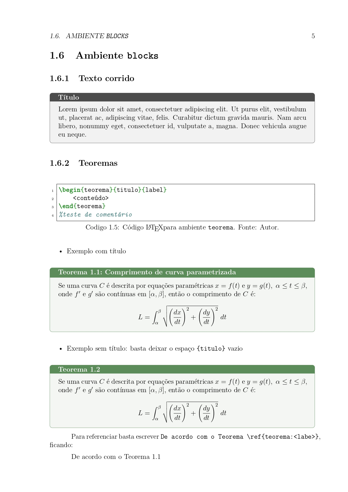
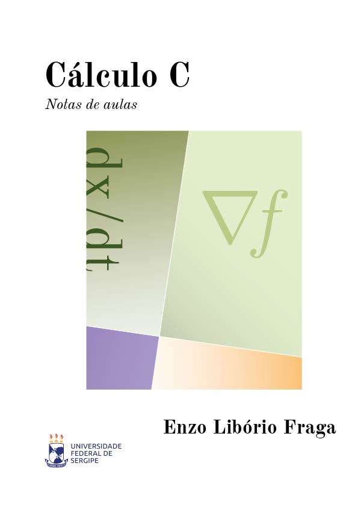
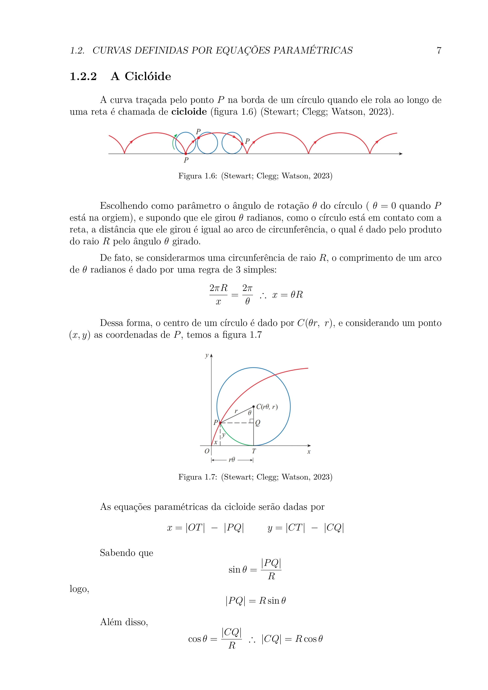
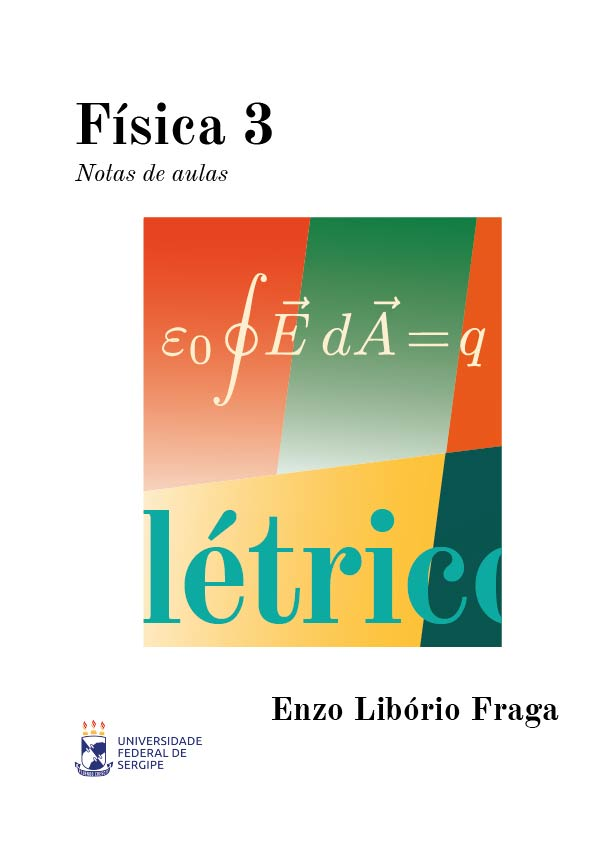
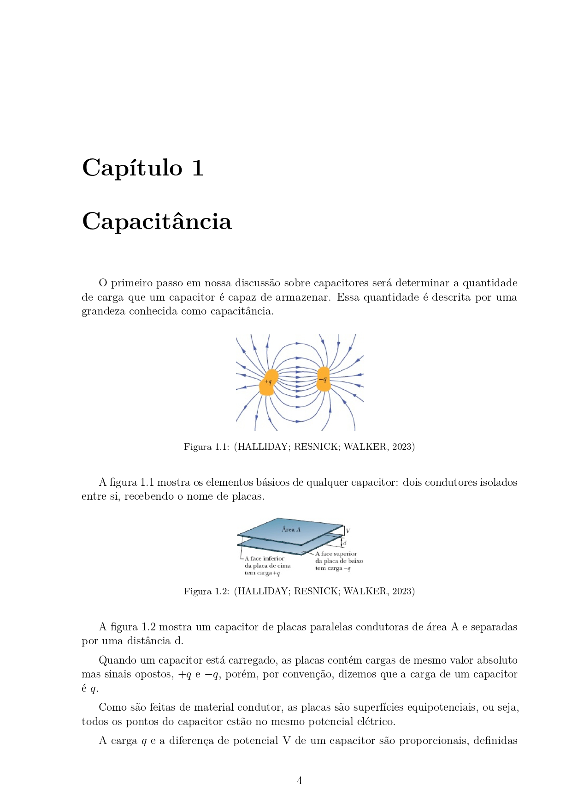

# Template $\LaTeX$ para *Notas de Aulas* 📝

Este template foi criado para uso de base em novas anotações das disciplinas do meu curso de Engenharia da Computação.

Basicamente, possui Capa, Sumário, Resumo, Capítulos, Apêndices e Referências Bibliográficas sendo possível a adição de qualquer estrutura a mais no código $\LaTeX$.

> ⚠️ Recomendo que utilize a verão disponível na [Overleaf Galery]() para maior facilidade de manuseio.

## Exemplos de utilizações 👨‍💻

👀 Para visualizar o template compilado, clique [aqui](./Notas_de_Aulas_template.pdf).

Nas minhas notas de aulas já produzidas, personalizei a capa para cada disciplina pelo [Adobe Illustrator](https://www.adobe.com/br/products/illustrator.html).   
No template, a capa utilizada possui apenas dados básicos e fica a cargo do utilizador modificá-la.

### Template
| Capa personalizável | Sumário |
| :-----------------: | :--------------------------: |
|  |  |
| Resumo | Exemplo básico de uma página |
|  |  |

### Cálculo C
| Capa personalizada | Exemplo básico de uma página |
| :-----------------: | :--------------------------: |
|  |  |

### Física 3
| Capa personalizada | Exemplo básico de uma página |
| :-----------------: | :--------------------------: |
|  |  |

## Atribuição e Licença 🤝

Este template é gratuito e de código aberto, licenciado sob a **Creative Commons Attribution 4.0 International**.   
Isso significa que você pode usar, modificar e compartilhar como quiser, até mesmo para fins comerciais, contanto que me dê o devido crédito.   
Veja o arquivo [`LICENSE`](./LICENSE.md) ou acesse [CC BY 4.0](https://creativecommons.org/licenses/by/4.0/) para mais informações.

Se você usar este template, por favor, inclua a seguinte atribuição em algum lugar do seu projeto ou documento:

Formato Sugerido:

> Esse documento foi criado a partir do modelo "Notas de Aulas" de Enzo Libório Fraga. Disponível em: https://github.com/enzoliborio/Notas_de_Aulas-template. Licenciado sob [CC BY 4.0](https://creativecommons.org/licenses/by/4.0/).

Você pode simplesmente deixar um comentário no seu arquivo `.tex` principal ou uma nota em seus agradecimentos. Obrigado!
